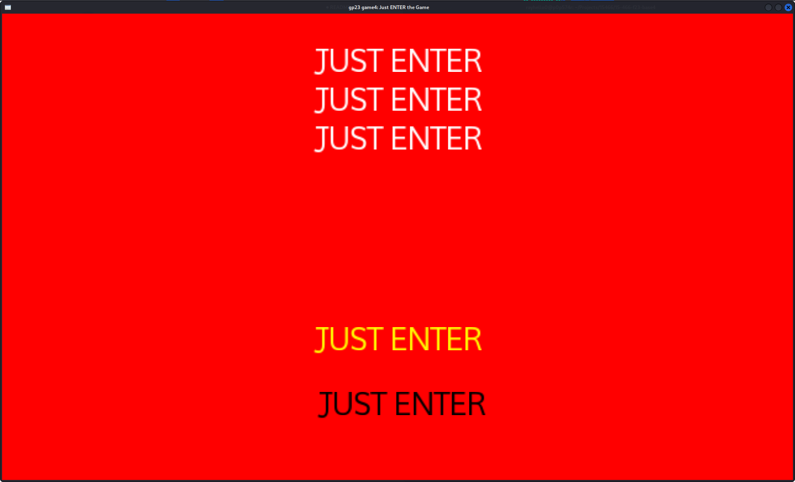

# Just ENTER the Game

Author: Sirui Huang, Sizhe Chen

Design: Just Enter and you'll know.

Text Drawing: 
Text Drawing is realized by using harfbuzz buffers to read FreeType fonts, and rendering them using openGL using VBO. This process is realized through the newly created utility file Text.hpp and Text.cpp, along with the openGL program ColorTextProgram. You can instantiate a text writing object Text and use the function show_text to display text on your screen, in the size, color, and position you like.

Choices: The choices are created using a txt file, where each state is encoded with a number, followed by lines of story, then followed by the two choices, which always begin with a number. The number represent the state the game will go to next. The game will read from this file and display the story and choices respective.

Screen Shot:

How To Play:

Top text is story.
Yellow text is the focused choice.
Black text is the unfocused choice.
Press enter to select your choice.
Press space to switch your choice.
Choose wisely.
Or just hit enter. 

Sources: https://fonts.google.com/specimen/Mooli

This game was built with [NEST](NEST.md).

